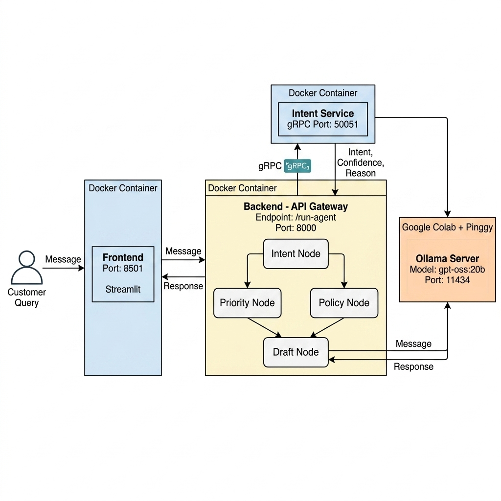

# 🏦 Banking AI-Agent — Microservice Architecture

> **Lab 4** — Applications of Natural Language Processing in Industry  
> University of Science — VNU-HCM | Faculty of Information Technology  
> **Student ID:** 23120190

An intelligent Banking Customer Support AI-Agent built with a **microservice architecture**, leveraging **gRPC** for inter-service communication, **Docker** for containerization, and **Ollama** for LLM inference.

---

## 📐 System Architecture

<p align="center">
  
</p>

### 🎥 Demo Video

You can watch the full system demonstration video showing the end-to-end customer chat experience, intent classification via gRPC, and the agentic workflow execution on Google Drive:

<p align="center">
  <a href="https://drive.google.com/drive/u/0/folders/1FI9MJKpIsRpe2YVVhv9R78WaHfmVvKQq" target="_blank">
    
  </a>
</p>

The system consists of **3 containerized microservices** orchestrated via Docker Compose:

| Service | Technology | Port | Description |
|---------|-----------|------|-------------|
| **Frontend** | Streamlit | `8501` | Chat interface for customers |
| **Backend (API Gateway)** | FastAPI | `8000` | Central orchestrator — routes requests, runs the agentic workflow |
| **Intent Service** | gRPC (Python) | `50051` | Classifies customer messages into BANKING77 intents |
| **Ollama** *(external)* | Ollama | `11434` | LLM server (`gpt-oss:20b`) running on Google Colab via Pinggy tunnel |

### Communication Flow

```
Customer ──► Frontend (Streamlit:8501)
                 │  HTTP POST
                 ▼
             Backend (FastAPI:8000)
                 │
          ┌──────┼──────────────┐
          │ gRPC │              │ HTTP
          ▼      │              ▼
   Intent Service│         Ollama Server
    (gRPC:50051) │        (Colab + Pinggy)
          │      │              │
          │ HTTP │              │
          └──►Ollama◄───────────┘
```

1. **Customer** sends a message via the Streamlit chat UI
2. **Frontend** forwards the message to the Backend via HTTP
3. **Backend** calls the **Intent Service** via gRPC to classify the intent
4. **Intent Service** queries **Ollama** to predict the intent (77 BANKING77 labels)
5. **Backend** runs the agentic pipeline (Priority → Policy → Draft → Validation → Router)
6. **Draft Node** calls **Ollama** to generate a customer-facing reply
7. **Final response** is sent back through the chain to the customer

---

## 🏗️ Project Structure

```
banking-service/
├── docker-compose.yml              # Docker Compose orchestration
├── architecture_diagram.png        # System architecture diagram
│
├── backend/                        # 🔵 API Gateway (FastAPI)
│   ├── Dockerfile
│   ├── requirements.txt
│   ├── run.py                      # Entrypoint
│   └── app/
│       ├── main.py                 # FastAPI app + endpoints
│       ├── agent/
│       │   └── orchestrator.py     # 6-node agentic workflow
│       ├── clients/
│       │   ├── grpc_intent_client.py   # gRPC client for Intent Service
│       │   ├── ollama_client.py        # HTTP client for Ollama
│       │   └── intent_grpc/            # Auto-generated gRPC stubs
│       ├── core/
│       │   ├── settings.py         # Environment-based configuration
│       │   └── schemas.py          # Pydantic data models
│       ├── data/
│       │   └── policies.py         # Banking policy knowledge base
│       └── nodes/
│           ├── intent_node.py      # Node 1: Intent detection (gRPC)
│           ├── priority_node.py    # Node 2: Priority assessment
│           ├── policy_node.py      # Node 3: Policy lookup
│           ├── draft_node.py       # Node 4: Reply generation (Ollama)
│           ├── validation_node.py  # Node 5: Quality validation
│           └── router_node.py      # Node 6: Action routing
│
├── intent_service/                 # 🟡 Intent Classification (gRPC)
│   ├── Dockerfile
│   ├── Makefile                    # Protobuf compilation
│   ├── intent_service.proto        # gRPC service definition
│   ├── intent_service_pb2.py       # Generated message code
│   ├── intent_service_pb2_grpc.py  # Generated service code
│   ├── requirements.txt
│   ├── server.py                   # gRPC server entrypoint
│   ├── client.py                   # Test client
│   └── app/
│       ├── core/
│       │   ├── settings.py
│       │   └── schemas.py
│       ├── nodes/
│       │   └── intent_node.py      # BANKING77 classification logic
│       └── clients/
│           └── ollama_client.py
│
└── frontend/                       # 🟢 Chat UI (Streamlit)
    ├── Dockerfile
    ├── requirements.txt
    └── interface.py                # Streamlit chat interface
```

---

## 🚀 Getting Started

### Prerequisites

- [Docker](https://docs.docker.com/get-docker/) & [Docker Compose](https://docs.docker.com/compose/install/)
- [Google Colab](https://colab.research.google.com/) (for running Ollama with GPU)
- [Pinggy](https://pinggy.io/) tunnel (to expose Colab's Ollama)

### Step 1 — Start Ollama on Google Colab

Run the Ollama notebook on Colab to:
1. Install and start Ollama
2. Pull the `gpt-oss:20b` model
3. Create a Pinggy tunnel to expose port `11434`

You will get a Pinggy URL like: `http://xxxxx.run.pinggy-free.link`

### Step 2 — Build Docker Images

```bash
cd banking-service
docker compose build
```

### Step 3 — Launch All Services

```bash
OLLAMA_BASE_URL=http://<your-pinggy-url> docker compose up -d
```

> **Note:** Replace `<your-pinggy-url>` with your actual Pinggy tunnel URL. Do NOT append `/api/chat` — the code handles that automatically.

### Step 4 — Verify

```bash
# Check all 3 containers are running
docker compose ps

# Health check
curl http://localhost:8000/health
# Expected: {"status":"ok"}
```

### Step 5 — Use the Application

| Interface | URL |
|-----------|-----|
| 💬 Chat UI (Streamlit) | http://localhost:8501 |
| 📖 API Docs (Swagger) | http://localhost:8000/docs |
| 🔍 Health Check | http://localhost:8000/health |

---

## 🔌 API Reference

### `GET /health`

Health check endpoint.

```bash
curl http://localhost:8000/health
```

**Response:**
```json
{"status": "ok"}
```

### `POST /run-agent`

Execute the full agentic workflow.

```bash
curl -X POST http://localhost:8000/run-agent \
  -H "Content-Type: application/json" \
  -d '{"message": "I lost my card"}'
```

**Response:**
```json
{
  "final_response": "I'm sorry to hear about your lost card. Please immediately...",
  "decision": {
    "action": "respond",
    "reason": "Complete response with all needed information"
  },
  "trace": {
    "intent": {
      "intent": "lost_or_stolen_card",
      "confidence": 0.95,
      "source": "grpc"
    },
    "priority": {
      "level": "critical",
      "reason": "Card security issue"
    },
    "policy": { ... },
    "draft": { ... },
    "validation": { ... }
  }
}
```

### `GET /config`

View current system configuration.

```bash
curl http://localhost:8000/config
```

---

## ⚙️ Configuration

All configuration is managed through **environment variables**:

| Variable | Default | Description |
|----------|---------|-------------|
| `OLLAMA_BASE_URL` | `http://host.docker.internal:11434` | Ollama server URL |
| `OLLAMA_MODEL` | `gpt-oss:20b` | LLM model name |
| `INTENT_SERVICE_HOST` | `intent-service` | Intent Service hostname |
| `INTENT_SERVICE_PORT` | `50051` | Intent Service gRPC port |

---

## 🧪 Agentic Workflow

The Backend runs a **6-node pipeline** for each customer message:

```
┌──────────────┐
│ Intent Node  │ → Classify intent via gRPC (BANKING77, 77 labels)
└──────┬───────┘
       │
  ┌────┴────┐
  ▼         ▼
┌────────┐ ┌────────┐
│Priority│ │ Policy │ → Assess urgency + Retrieve banking policy
│  Node  │ │  Node  │
└───┬────┘ └───┬────┘
    └────┬─────┘
         ▼
  ┌──────────────┐
  │  Draft Node  │ → Generate reply via Ollama LLM
  └──────┬───────┘
         ▼
  ┌──────────────┐
  │ Validation   │ → Check quality, completeness, confidence
  │    Node      │
  └──────┬───────┘
         ▼
  ┌──────────────┐
  │ Router Node  │ → Decide: respond / ask_more / escalate
  └──────────────┘
```

---

## 🔧 gRPC Service Definition

The Intent Service is defined using Protocol Buffers:

```protobuf
syntax = "proto3";
package intent_classify.v1;

service IntentService {
    rpc IntentRecognizer (IntentRequest) returns (IntentResponse) {}
}

message IntentRequest {
    string message = 1;
}

message IntentResponse {
    string intent = 1;
    float confidence = 2;
    string reason = 3;
}
```

To regenerate gRPC stubs:

```bash
cd intent_service
make clean && make
```

---

## 🐳 Docker Commands Reference

| Command | Description |
|---------|-------------|
| `docker compose build` | Build all images |
| `docker compose up -d` | Start all services (detached) |
| `docker compose ps` | List running containers |
| `docker compose logs -f backend` | Follow backend logs |
| `docker compose logs -f intent-service` | Follow intent service logs |
| `docker compose down` | Stop and remove all containers |
| `docker compose restart backend` | Restart a specific service |

---

## 🛠️ Tech Stack

| Component | Technology | Version |
|-----------|-----------|---------|
| API Gateway | FastAPI | ≥ 0.110 |
| ASGI Server | Uvicorn | ≥ 0.27 |
| Frontend | Streamlit | ≥ 1.32 |
| RPC Framework | gRPC | ≥ 1.62 |
| Data Validation | Pydantic | ≥ 2.6 |
| LLM Runtime | Ollama | Latest |
| LLM Model | gpt-oss:20b | — |
| Containerization | Docker + Docker Compose | — |
| Language | Python | 3.10 |

---

## 📝 License

This project is developed for educational purposes as part of the **Applications of NLP in Industry** course at the University of Science, VNU-HCM.
